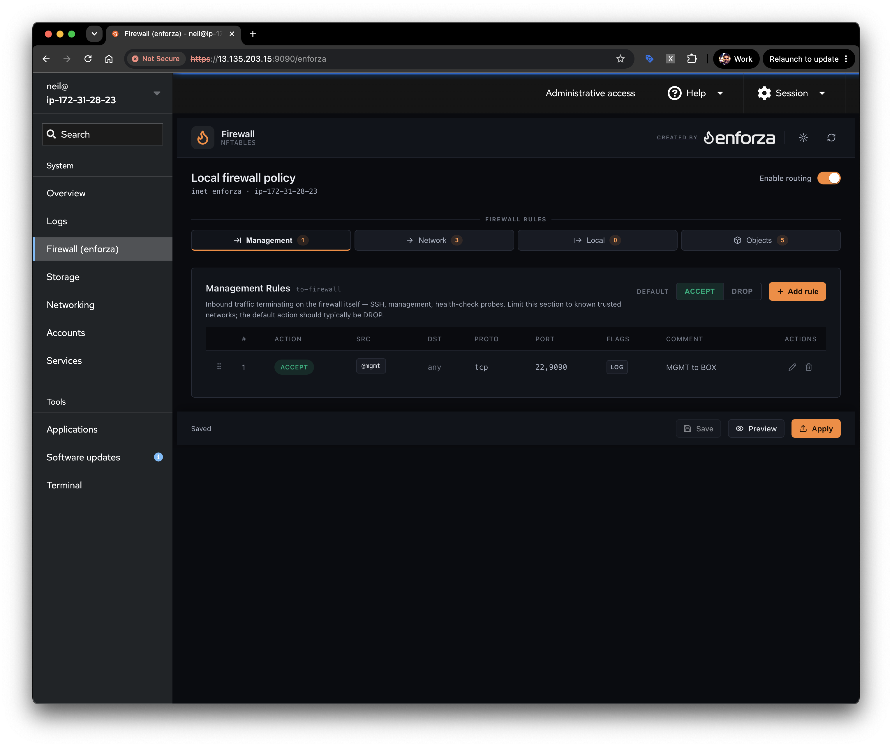
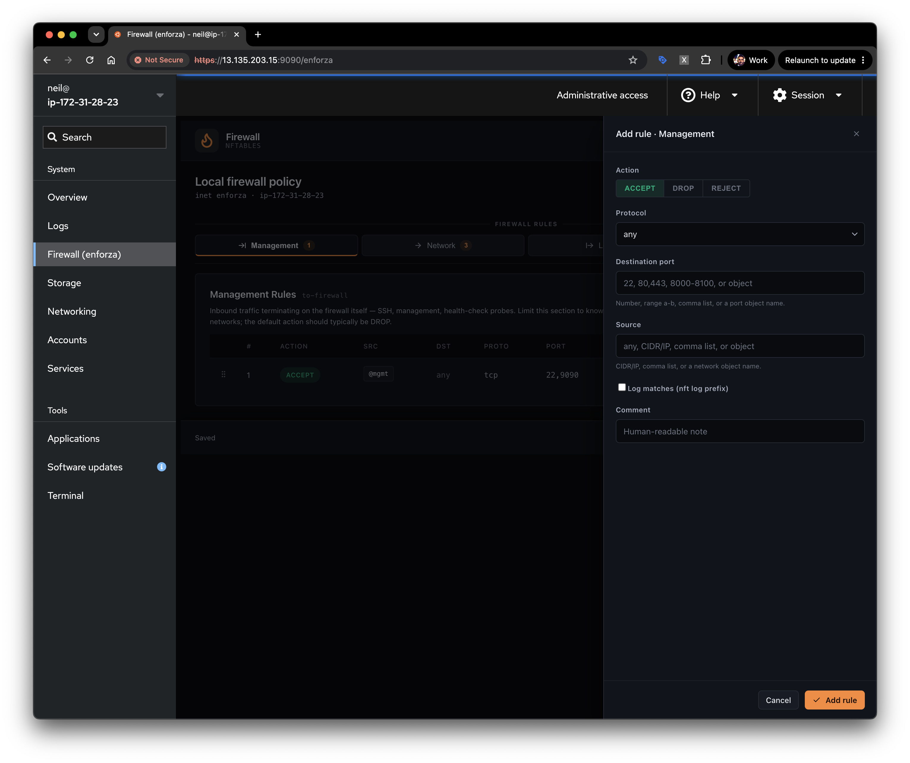
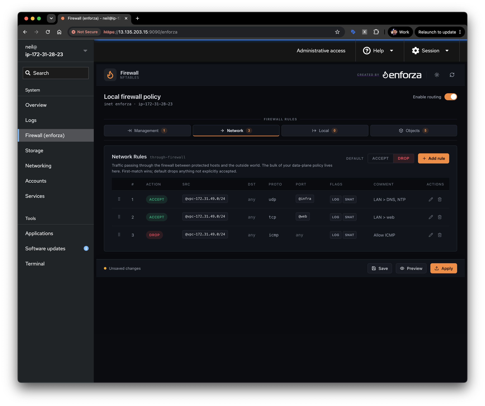
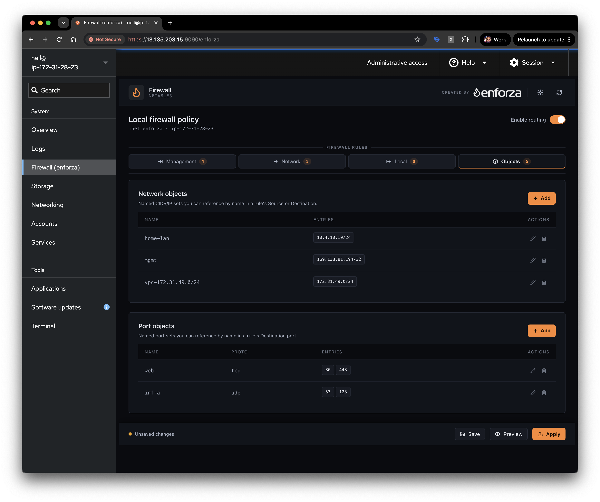

# Getting started with enforza-cockpit

A step-by-step guide to installing **enforza-cockpit** on a server, building your
first firewall policy in the browser, and watching the per-rule logs land in
`/var/log/syslog`.



## What you're building

Following this guide turns a single Linux box into a **self-contained firewall,
router, and management console — all in one, standalone.** There's nothing else to
run and nothing external to depend on:

- **Firewall** — the three rule sections (Management / Network / Local) compile to a
  live `nftables` ruleset that filters traffic *to*, *through*, and *from* the host.
- **Router / NAT gateway** — flip on **Enable routing** (IP forwarding) and the box
  routes between its interfaces; mark a Network rule **SNAT** and it masquerades
  outbound traffic, so it works as an edge gateway for the machines behind it.
- **Management console** — Cockpit's web UI *is* the console. You build, preview,
  apply, and log every rule from the browser — no separate controller, no agent
  phoning home, no cloud account.

Because it runs entirely on the one host and inside Cockpit's own auth + TLS, the
result is a stand-alone appliance: install it on a VM, a home server, or a small
cloud instance and it's immediately a working firewall/router you manage from a web
page. (When you need to manage *many* of these from one place, that's where the
commercial [enforza](https://enforza.io) Cloud Controller comes in — see below.)

> **Safety first.** enforza-cockpit manages a live `nftables` firewall. Every
> apply uses a **confirm-or-revert** model: after you click **Apply**, you have
> 60 seconds to click **Confirm**, or the previous ruleset is automatically
> restored. This means a bad rule can't permanently lock you out — but you should
> still keep a second way onto the box (a console session or a second SSH session)
> handy the first few times.

---

## The same GUI as the enforza Cloud Controller

enforza-cockpit is **free and open source**, built for homelabs and self-hosted
servers. The policy editor you're about to use is a faithful **visual replica of the
GUI in the [enforza](https://enforza.io) Cloud Controller** — the console behind our
commercial cloud-firewall platform. Same look, same tab layout (Management / Network
/ Local), same object model, same rule editor.

The difference is what sits *underneath* it. This community tool is a friendly GUI
that renders your policy straight to **`nftables`** and lets the Linux kernel do the
enforcing — nothing more. The commercial offering runs enforza's own
**single-pass packet-inspection-and-verdict engine**: it classifies flows, applies
L7 (FQDN/SNI) policy, and decides the vast majority of packets **in-kernel at line
rate** — a lot more than a static `nftables` ruleset can do on its own.

If you like the workflow here and want to run it across a fleet — with central
management, live logs, and L7 egress control — the commercial platform picks up
where this leaves off.

### What you get here (free) vs. the enforza Cloud Controller (commercial)

| Capability | enforza-cockpit (free) | enforza Cloud Controller (commercial) |
|------------|:----------------------:|:-------------------------------------:|
| Visual nftables rule editor (Management / Network / Local sections) | ✅ | ✅ |
| Network & port **objects** | ✅ | ✅ (Network & VM objects) |
| Per-rule logging (ALLOW / DENY / REJECT) | ✅ (local syslog) | ✅ **Live log streaming** across the fleet |
| Confirm-or-revert safe apply | ✅ | ✅ |
| SNAT / masquerade & IP-forwarding | ✅ | ✅ **Secure NAT Gateway** |
| **Single-pass packet-inspection & verdict engine** (µs-scale, in-kernel) | ❌ (plain nftables) | ✅ ~49.5 µs p99 first-packet classification |
| **L7 egress filtering** — FQDN / SNI-based outbound control (no TLS decryption) | ❌ | ✅ |
| North-South **and** East-West / VPC-to-VPC traffic control | ❌ | ✅ |
| Cloud **IP-range / Service-Tag imports** (AWS, Azure) | ❌ | ✅ |
| **Central Cloud Controller console** — live map, health, license usage | ❌ (single host) | ✅ |
| **Manage many firewalls at once** — push one policy to a whole fleet | ❌ | ✅ |
| **Policy-as-Code / GitOps** (review & merge policy in a pipeline) | ❌ | ✅ |
| **Compliance packs** — PCI DSS, ISO 27001, HIPAA, FedRAMP, DORA, CMMC + more | ❌ | ✅ 25 frameworks / 210 controls |
| **SIEM export** (logs go to *your* SIEM, never through enforza's cloud) | ❌ | ✅ |
| Multi-cloud & on-prem, self-upgrade with rollback | ❌ | ✅ |

> **In short:** enforza-cockpit gives the homelab a clean GUI wrapper for a local
> `nftables` firewall. The commercial [enforza](https://enforza.io) platform wraps
> the same GUI around our own packet-inspection-and-verdict engine and a cloud
> controller that manages many firewalls at once. Use this free tool for as long as
> you like — and when you outgrow a single hand-managed host, you'll already know
> the interface.

---

## 1. What you need

- A Linux server with **root/sudo** access (Debian/Ubuntu, Fedora, RHEL/Rocky/Alma,
  or openSUSE).
- Inbound access to **TCP 9090** (Cockpit's web port) from wherever you'll browse
  from. On a cloud instance, open 9090 in the security group / firewall to *your*
  IP only.
- A web browser.

---

## 2. Install the dependencies

Clone the repo and run the bootstrap script. It detects your package manager
(`apt` / `dnf` / `yum` / `zypper`) and installs `nftables`, the nftables
JSON/Python bindings, `ulogd2`, and Cockpit itself.

```bash
git clone https://github.com/synvu/enforza-cockpit.git
cd enforza-cockpit
sudo ./bootstrap.sh
```

The script also enables the core services so they survive a reboot:

- `cockpit.socket` — started immediately (this is what serves the web UI).
- `nftables.service` — enabled but **not** started with an empty ruleset (so it
  can't lock you out before you've written a policy).
- `ulogd2` / `ulogd` — enabled for userspace netfilter logging.

When it finishes you should see:

```
[enforza-cockpit] All core dependencies present.
[enforza-cockpit] Done. Open Cockpit at https://<your-host>:9090 ...
```

---

## 3. Install the plugin into Cockpit

The plugin is a set of static files plus a small privileged helper. `deploy.sh`
copies `dist/` into Cockpit's system package directory
(`/usr/share/cockpit/enforza`), where `cockpit-ws` serves it to every logged-in
administrator.

```bash
sudo ./deploy.sh
```

You'll see:

```
[enforza-cockpit] deploying .../dist -> /usr/share/cockpit/enforza
[enforza-cockpit] done. Reload Cockpit in the browser (Ctrl/Cmd+R) to pick up changes.
```

> Re-run `sudo ./deploy.sh` any time you edit anything under `dist/`, then hard-
> reload the browser tab.

---

## 4. Open Cockpit and find the plugin

1. Browse to **`https://<your-host>:9090`**.
2. The certificate is self-signed on a fresh install — accept the browser warning
   (or install a real cert later).
3. Log in with a **local system account that can use sudo** (Cockpit uses your OS
   login; the firewall plugin needs administrative privilege).
4. If Cockpit shows a **"Limited access"** banner at the top, click it and
   re-authenticate so the plugin can run privileged commands.
5. In the left-hand menu, open **Firewall (enforza)**.

You'll land on the **Local firewall policy** page with four tabs:

| Tab            | nftables hook | What it controls |
|----------------|---------------|------------------|
| **Management** | `input`       | Traffic **to** the firewall host itself — SSH, the Cockpit port, health checks. |
| **Network**    | `forward`     | Traffic passing **through** the box between other hosts and the internet. |
| **Local**      | `output`      | Traffic originating **from** the host — updates, DNS, outbound calls. |
| **Objects**    | —             | Reusable named network (CIDR) and port sets you can reference in rules. |

Each rule section has a **Default** action (accept / drop). First match wins;
anything not matched falls through to the default.


---

## 5. Create a simple policy

Let's build a minimal, safe **Management** policy: allow SSH (logged), allow the
Cockpit port, and log everything else that gets dropped.

### 5a. Set the default action

1. Open the **Management** tab.
2. Set **Default** to **drop** (it usually is already). This means only traffic
   you explicitly allow reaches the host.

### 5b. Add an "allow SSH" rule (with logging)

1. Click **Add rule**.
2. Fill in the drawer:
   - **Action:** `accept`
   - **Protocol:** `tcp`
   - **Destination port:** `22`
   - **Source:** your admin IP or CIDR (e.g. `203.0.113.10/32`), or `any` to start.
   - ✅ Tick **Log matches (nft log prefix)** — this is what puts the rule in
     `/var/log/syslog`.
   - **Comment:** `SSH from admin` — this text is included in the log line, so make
     it meaningful.
3. Click **Add rule**.



### 5c. Add an "allow Cockpit" rule

1. **Add rule** again → **Action** `accept`, **Protocol** `tcp`,
   **Destination port** `9090`, **Source** your admin IP, **Comment**
   `Cockpit UI`. (Logging optional.)
2. **Add rule**.

> ⚠️ Always allow SSH (22) **and** Cockpit (9090) from your own IP *before* you
> apply a default-drop Management policy — otherwise you'll rely on the auto-revert
> to get back in.

### 5d. (Optional) Add an explicit "log and drop" catch-all

The section **default** action drops silently — a default-policy drop is *not*
logged. To *see* denied traffic in syslog, add an explicit last rule:

1. **Add rule** → **Action** `drop`, **Protocol** `any`, **Source** `any`,
   ✅ **Log matches**, **Comment** `catch-all deny`.
2. **Add rule**. Make sure it sits **last** in the list (drag the ⠿ grip handle to
   reorder if needed — first match wins).

You can use **Action: reject** instead of `drop` if you'd rather send an active
rejection (and see `REJECT` in the logs) rather than dropping silently.

### 5e. Preview, apply, confirm

1. Click **Preview** (bottom bar) to render the policy to nftables JSON and
   dry-run it against the kernel. A green "Valid" banner means the kernel accepts
   it.
2. Click **Apply**.
3. A **confirm-or-revert** banner appears with a 60-second countdown.
4. **Verify you still have access** — open a new SSH session, or just confirm the
   Cockpit page is still responsive.
5. Click **Confirm** to keep the ruleset. (If anything broke, do nothing and it
   auto-reverts, or click **Revert now**.)
6. Click **Save** to persist the policy document to `/etc/enforza/policy.json` so
   it reloads next time.

Your rules are now live in the `inet enforza` nftables table.

### 5f. Beyond Management: Network rules & Objects

The **Network** tab (the `forward` path) is where you turn the box into a gateway:
rules there can carry both a **LOG** flag and a **SNAT** (masquerade) flag, so
traffic from the hosts behind the firewall is logged and source-NAT'd out to the
internet. Reference reusable **@objects** for source/destination and ports to keep
rules readable.



The **Objects** tab holds reusable **network** (CIDR/IP) and **port** sets. Define
`mgmt`, `home-lan`, `web`, `infra` once and reference them by name (`@mgmt`,
`@web`, …) across any rule — edit the object and every rule using it updates.



---

## 6. Watch the logs in `/var/log/syslog`

Any rule with **Log matches** ticked emits a kernel log line each time it matches.
enforza-cockpit tags every line with:

- the section name (`to-firewall` / `through-firewall` / `from-firewall`),
- the **verdict word** — `ALLOW`, `DENY`, or `REJECT`,
- and your rule's **comment**.

### Tail everything from enforza

```bash
sudo tail -f /var/log/syslog | grep enforza
```

A matched SSH accept looks like this (the kernel appends the packet fields):

```
Jul  8 12:01:22 host kernel: enforza to-firewall ALLOW: SSH from admin IN=eth0 OUT= MAC=... SRC=203.0.113.10 DST=10.0.0.5 ... PROTO=TCP SPT=51514 DPT=22 ...
```

A dropped packet caught by the catch-all:

```
Jul  8 12:03:44 host kernel: enforza to-firewall DENY: catch-all deny IN=eth0 OUT= ... PROTO=TCP ... DPT=3389 ...
```

### Filter by verdict

Because the verdict is a plain word in the prefix, you can grep for exactly what
you care about:

```bash
# Only denials
sudo tail -f /var/log/syslog | grep 'enforza.*DENY'

# Only accepts
sudo tail -f /var/log/syslog | grep 'enforza.*ALLOW'

# Rejects
sudo tail -f /var/log/syslog | grep 'enforza.*REJECT'

# One specific rule, by its comment
sudo tail -f /var/log/syslog | grep 'SSH from admin'
```

### If your distro uses the journal instead

On systems without `/var/log/syslog` (many `dnf`-based distros), read the kernel
log through `journalctl`:

```bash
sudo journalctl -kf | grep enforza
```

### Generate some traffic to test

From another machine, try to reach an allowed and a blocked port, then watch the
tail:

```bash
# allowed (should connect + log ALLOW)
ssh you@<your-host>

# blocked (should log DENY / REJECT)
nc -vz <your-host> 3389
```

---

## 7. Troubleshooting

| Symptom | Fix |
|---------|-----|
| **Firewall (enforza)** not in the Cockpit menu | Re-run `sudo ./deploy.sh`, then hard-reload the browser (Ctrl/Cmd+R). |
| "Could not load policy… administrative access" | Click the **Limited access / Administrative access** button at the top of Cockpit and re-authenticate. |
| Apply auto-reverted | You didn't click **Confirm** within 60s, or a rule broke your connection. The old ruleset is restored — adjust the rule and try again. |
| No log lines appear | Confirm the rule has **Log matches** ticked, that you **Applied + Confirmed**, and that matching traffic is actually hitting the rule. Remember the section *default* drop is not logged — add an explicit log+drop rule. |
| Locked out of the box entirely | Get on via the cloud console / out-of-band access and run `sudo nft flush ruleset` (or `sudo nft delete table inet enforza`) to clear the policy. |

---

## Reference

- **Plugin files (served):** `/usr/share/cockpit/enforza/`
- **Saved policy:** `/etc/enforza/policy.json`
- **nftables table:** `inet enforza`
- **Inspect the live ruleset from the shell:** `sudo nft list table inet enforza`
- **Cockpit URL:** `https://<your-host>:9090`
